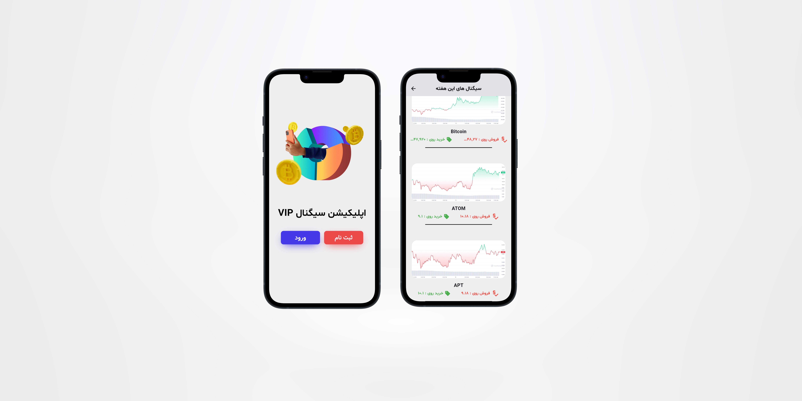

# Crypto VIP Signal App

## Overview 

This is a simple sampled signal App to showcase buy/sell signal in Cryptocurrency written with Dart language programming. The app allows users to have a set of crypto signals to buy/sell if they are logged in , although this is just a prototype and it's a UI design. 

## Features 

 - Main Functionality : gives users a list of crypto signal with name , picture , sell price , buy price

## Technologies User 
 
 - Language: Dart 

## Setup 

To run the application do the following : 
 1. Clone the repository.
 2. Open the project in Android Studio / vscode. 
 3. build and run the app wherever you wish to.
